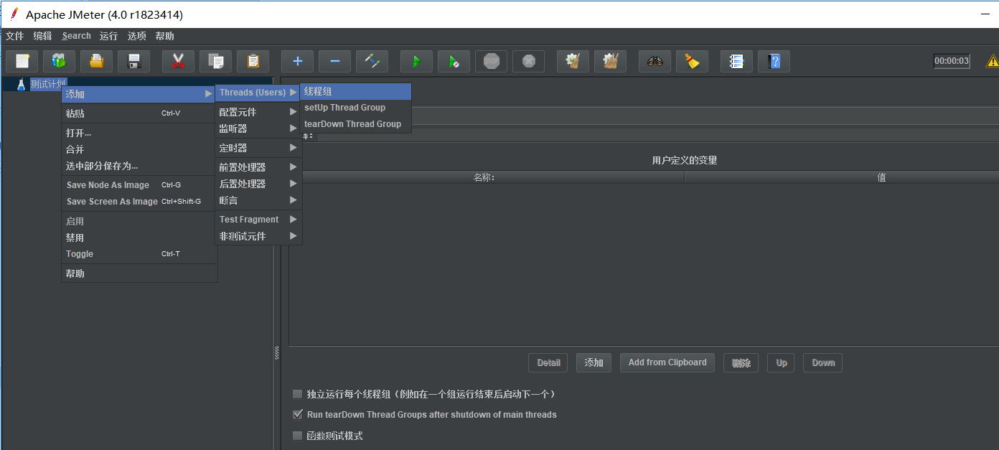
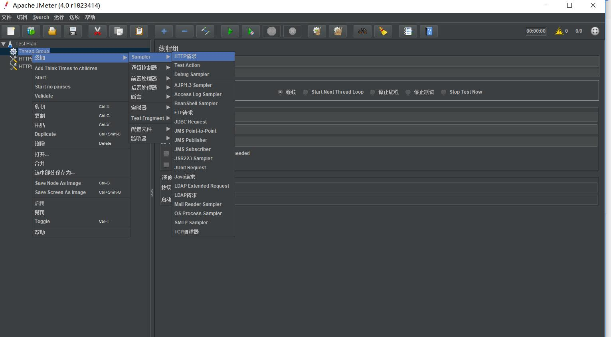
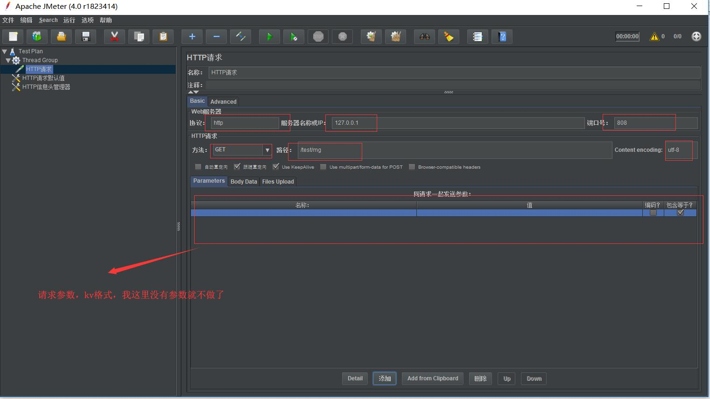
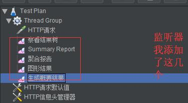
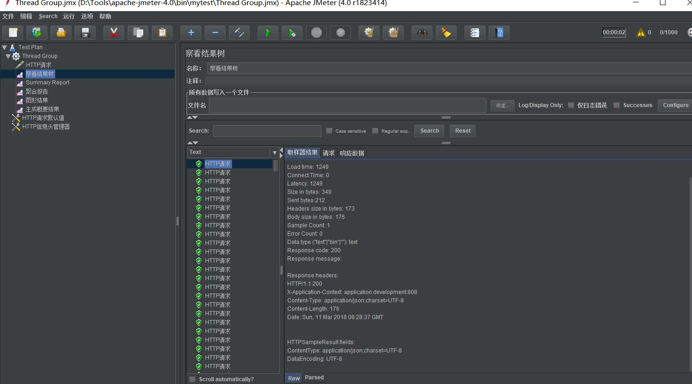
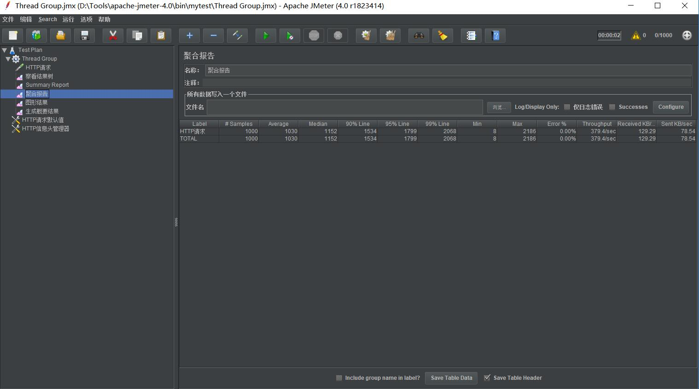

记录下Jemeter测试<!--more-->

开发中使用了jmeter做压测，记录下Jmeter测试，很简单的，图挺多的<!--more-->

### 安装Jemeter

​	这里以jemeter4.0为例，安装环境为win10

```
http://mirrors.shu.edu.cn/apache//jmeter/binaries/apache-jmeter-4.0.zip
```

​    	下载完毕后，解压开，进入bin下 执行jmeter.bat进入界面化窗口

​	更改语言选项：options-->changeLangauage-->chinese simplefied

### 测试

- **创建测试计划添加线程组**，选择文件-->新建，右击新建的测试计划--->添加-->Threads，线程组的名称可以自己设定

  

  线程组说明:

  

- **创建http请求默认值**

  

  这里默认请求到 index

- **创建http请求头** 

  这里只做了个浏览器Accept-Encoding的设置

  

- 创建http请求

  

  

- **添加监听器**

  ​

  

- **运行**

  执行完毕，查看各个监听器

  * 结果树监听器

    

    

  * **Summary Report 概要报告** 

    

    字段解释：

    * Label：监听器名称
    * Samples: 取样器运行次数,总样本数
    * Average：平均完成一次事务或请求的时间，即平均响应时间 ms
    * Min：最小响应时间 ms
    * Max: 最大响应时间 ms
    * Std.Dev：偏离量，越小表示越稳定  响应时间的标准方差。
    * Error %：错误事务率，未命中比率
    * Throughput：吞吐率（TPS）
    * Received KB/sec：每秒接收数据包流量，单位是 KB
    * Sent KB/sec：每秒发送数据包流量，单位是 KB
    * Avg.Bytes：平均数据流量，单位是 Byte

  * **聚合报告** 

    

    字段说明：

    - Label：监听器名称
    - Samples: 发送请求的数量
    - Average：平均完成一次事务或请求的时间，即平均响应时间 ms
    - Median：所有响应时间的中间值，也就是 50％ 用户的响应时间
    - 90%Line：90%请求的响应时间 即 90% 请求响应时间不会超过这个值
    - 95%Line：95%请求的响应时间 即 95% 请求响应时间不会超过这个值
    - 99%Line：99% 用户的响应时间 即 99% 请求响应时间不会超过这个值
    - Min:最小响应时间 ms
    - Max: 最大响应时间 ms
    - Error %：错误事务率，未命中比率,请求失败率
    - Throughput：吞吐率（TPS）
    - Received KB/sec：每秒接收数据包流量，单位是 KB
    - Sent KB/sec：每秒发送数据包流量，单位是 KB 

  * **图形结果分析** 

    

    字段解释：

    * 样本数目：总请求量
    * 最新样本：代表时间的数字，服务器响应最后一个请求的时间
    * 吞吐量: 服务器每分钟处理请求数
    * 平均: 总运行时间/发送到服务器的总请求数
    * 中间：代表时间的数字，表示有一半的服务器的响应时间低于于该数值
    * 偏离：服务器响应时间变化、离散程度测量值的大小，或者，换句话说，就是数据的分布

当然还有其他的一些监听器，比如Aggregate Graph, ResponseTime Graph 等等，很简单的，看看就会了