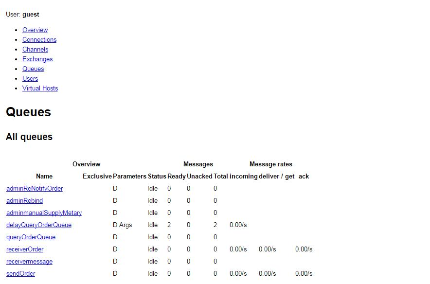
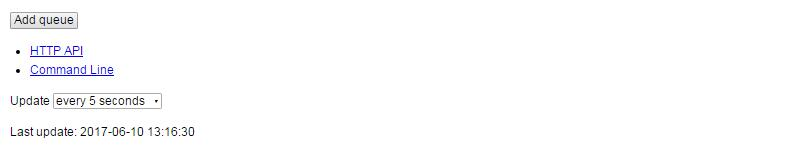

RabbitMq定时消息队列的实现<!--more-->

> ​	开发中用的rabbitmq,有一个场景需要进行延时消息投递,(应用环境比如某个消息多长时间后进行做某业务操作)但是rabbitmq没有类似的实现,activemq却是有的(基于ttl的死信队列),那么参考了网上了一些教程后,总结了下 .

* 首先基础的xml配置如下

  ```
  <?xml version="1.0" encoding="UTF-8"?>
  <beans xmlns="http://www.springframework.org/schema/beans"
  	xmlns:rabbit="http://www.springframework.org/schema/rabbit" xmlns:xsi="http://www.w3.org/2001/XMLSchema-instance"
  	xsi:schemaLocation="http://www.springframework.org/schema/beans
         http://www.springframework.org/schema/beans/spring-beans.xsd
         http://www.springframework.org/schema/rabbit
         http://www.springframework.org/schema/rabbit/spring-rabbit-1.0.xsd">
  	<rabbit:connection-factory id="connectionFactory"
  		username="userName" password="password" host="host"
  		port="port" />
  	<rabbit:template id="amqpTemplate" connection-factory="connectionFactory"
  		exchange="exchangeName" />
  	<rabbit:admin connection-factory="connectionFactory" />
  	<rabbit:listener-container
  		connection-factory="connectionFactory" acknowledge="auto" concurrency="2" prefetch="2">
  	</rabbit:listener-container>
      <bean id="jsonMessageConverter" class="org.springframework.amqp.support.converter.Jackson2JsonMessageConverter" />
  </beans> 
  ```

* 项目使用的rabbitmq与spring-amp集成,定义延迟转发队列及延迟接收队列

  ```
  <?xml version="1.0" encoding="UTF-8"?>
  <beans xmlns="http://www.springframework.org/schema/beans"
  	xmlns:rabbit="http://www.springframework.org/schema/rabbit" xmlns:xsi="http://www.w3.org/2001/XMLSchema-instance"
  	xsi:schemaLocation="http://www.springframework.org/schema/beans
         http://www.springframework.org/schema/beans/spring-beans.xsd
         http://www.springframework.org/schema/rabbit
         http://www.springframework.org/schema/rabbit/spring-rabbit-1.0.xsd">
  	<rabbit:connection-factory id="connectionFactory"
  		username="userName" password="password" host="host"
  		port="port" />
  	<rabbit:template id="amqpTemplate" connection-factory="connectionFactory"
  		exchange="exchangeName" /><rabbit:admin connection-factory="connectionFactory" />
                   <!--延迟队列定义 x-message-ttl 为延迟时间为毫秒 x-dead-letter-exchange 为转发到哪个exchange x-dead-letter-routing-key 为转发后哪个队列接收延迟消息即真正消费消息的queue的routkey-->
  		<rabbit:queue name="延迟队列名" durable="true" auto-delete="false" exclusive="false" > <rabbit:queue-arguments> <entry key="x-message-ttl"> <value type="java.lang.Long">60000</value></entry> <entry key="x-dead-letter-exchange" value="转发到哪个路由"/> <entry key="x-dead-letter-routing-key" value="真正的消费routekey"/> </rabbit:queue-arguments> </rabbit:queue>    
  	<rabbit:queue name="真正消费queue名" durable="true" auto-delete="false" exclusive="false" >
  <!--进行队列与路由绑定-->
  <rabbit:direct-exchange name="路由名称" durable="true" auto-delete="false">
          <rabbit:bindings>
  			<rabbit:binding queue="延迟队列名" key="延迟队列routeKey" ></rabbit:binding>
  			<rabbit:binding queue="真正消费队列名" key="真正消费队列名routeKey"></rabbit:binding>
          </rabbit:bindings>
      </rabbit:direct-exchange>
  <rabbit:listener-container
  		connection-factory="connectionFactory" acknowledge="auto" concurrency="2" prefetch="2">
  		<rabbit:listener queues="真正消费队列名routeKey" ref="真正消费者类的首字母小写"/>
  </rabbit:listener-container>
      <bean id="jsonMessageConverter" class="org.springframework.amqp.support.converter.Jackson2JsonMessageConverter" />
  </beans>
  ```

* 这样就实现了一个延时转发队列,基本原理是利用ttl进行队列消息转发进行处理 

* activemq就比较好解决这个问题,有个delayTime,那么就很简单的实现消息转发

* 附rabbitmq的后台死信队列图示:

   

  

  从上面可以模糊的看出delayQueryOrderQueue是一个延时队列,当到了时间之后,会转发到queryOrderQueue