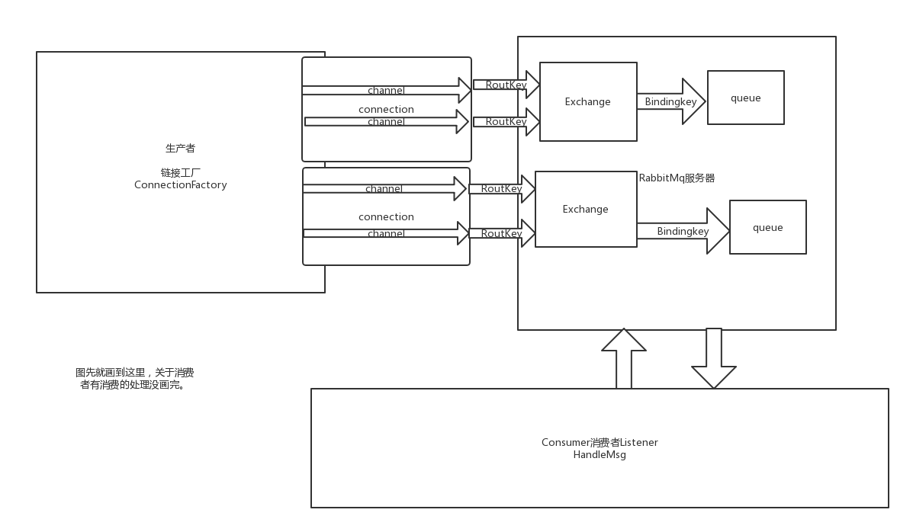

RabbitMq的一些简单介绍<!--more-->

#### RabbitMq的几个简单概念的介绍

* Broker

  消息队列服务器的实体。接收和分发消息的应用。

* Exchange

  简单的说就是路由器。当msg到达broker的时候，根据分发规则(消息策略),匹配相应的routing key,binding消息保存再exchange中，进行用于msg的分发路由。简单的说就是接收消息，转发消息到绑定的队列上，指定消息按什么规则，路由到哪个队列。  

* Queue

  消息队列，用于存储消息，相同属性的queue可以重复定义，每个msg可以重复放在一个或者多个队列中，每个队列的消息都是隔离的。

* Binding

  通过路由规则讲路由器和队列进行绑定起来，比如 一个exchangA可能有队列B,C,D，另一个exchangeE可能有队列G,H,J

* RoutingKey 

  路由的指定key，exchange可以根据这个key进行消息投递路由

* Producter 

  消息生产者

* Consumer

  消息消费者

* Channel

  消息通道，客户端与服务端的链接中可能有多个消息通道。每个Channel代表一个通话

  这是Cache

  ```
  	public static class Cache {
  
  		private final Channel channel = new Channel();
  
  		private final Connection connection = new Connection();
  
  		public Channel getChannel() {
  			return this.channel;
  		}
  
  		public Connection getConnection() {
  			return this.connection;
  		}
  
  		public static class Channel {
  
  			/**
  			 * Number of channels to retain in the cache. When "check-timeout" > 0, max
  			 * channels per connection.
  			 */
  			private Integer size;
  
  			/**
  			 * Number of milliseconds to wait to obtain a channel if the cache size has
  			 * been reached. If 0, always create a new channel.
  			 */
  			private Long checkoutTimeout;
  
  			public Integer getSize() {
  				return this.size;
  			}
  
  			public void setSize(Integer size) {
  				this.size = size;
  			}
  
  			public Long getCheckoutTimeout() {
  				return this.checkoutTimeout;
  			}
  
  			public void setCheckoutTimeout(Long checkoutTimeout) {
  				this.checkoutTimeout = checkoutTimeout;
  			}
  
  		}
  ```

  这是RabbitMq的connection

  ```
  public static class Connection {
  
  			/**
  			 * Connection factory cache mode.
  			 */
  			private CacheMode mode = CacheMode.CHANNEL;
  
  			/**
  			 * Number of connections to cache. Only applies when mode is CONNECTION.
  			 */
  			private Integer size;
  
  			public CacheMode getMode() {
  				return this.mode;
  			}
  
  			public void setMode(CacheMode mode) {
  				this.mode = mode;
  			}
  
  			public Integer getSize() {
  				return this.size;
  			}
  
  			public void setSize(Integer size) {
  				this.size = size;
  			}
  
  		}
  ```

  具体的都在springboot中的RabbitProperties类中。

#### 在Spring中的xml配置

​	这里使用xml进行展示 是因为比起springboot的代码配置方式，xml配置更加直观

```

<?xml version="1.0" encoding="UTF-8"?>
<beans xmlns="http://www.springframework.org/schema/beans"
	xmlns:rabbit="http://www.springframework.org/schema/rabbit" xmlns:xsi="http://www.w3.org/2001/XMLSchema-instance"
	xsi:schemaLocation="http://www.springframework.org/schema/beans
       http://www.springframework.org/schema/beans/spring-beans.xsd
       http://www.springframework.org/schema/rabbit
       http://www.springframework.org/schema/rabbit/spring-rabbit-1.0.xsd">
        <!--链接工厂-->
        <rabbit:connection-factory id="connectionFactory"
            username="userName" password="password" host="host"
            port="port" />
        <rabbit:template id="amqpTemplate" connection-factory="connectionFactory"
            exchange="exchangeName" /><rabbit:admin connection-factory="connectionFactory" />
		
<!--队列定义-->
<rabbit:queue name="队列名" durable="true" auto-delete="false" exclusive="false" > 
<!--这里可以定义一些队列参数-->
<!--
<rabbit:queue-arguments> <entry key="x-message-ttl"> <value type="java.lang.Long">60000</value></entry><entry key="x-dead-letter-exchange" value="转发到哪个路由"/> <entry key="x-dead-letter-routing-key" value="消费routekey"/> </rabbit:queue-arguments>
-->
</rabbit:queue>

<!--进行队列与路由分发器绑定-->
<rabbit:direct-exchange name="路由名称" durable="true" auto-delete="false">
        <rabbit:bindings>
			<rabbit:binding queue="消费队列名" key="消费队列名routeKey"></rabbit:binding>
        </rabbit:bindings>
    </rabbit:direct-exchange>
  <!--消费者配置-->
<rabbit:listener-container
		connection-factory="connectionFactory" acknowledge="auto" concurrency="2" prefetch="2">
		<rabbit:listener queues="消费队列名routeKey" ref="消费者类的首字母小写"/>
</rabbit:listener-container>
    <bean id="jsonMessageConverter" class="org.springframework.amqp.support.converter.Jackson2JsonMessageConverter" />
</beans> 
```


#### 图示



